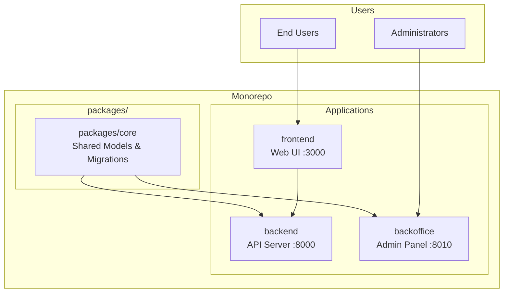

# [Your Project Name]

A brief description of your project goes here.

## Architecture Overview

> **Note:** The architecture below is an example from a Laravel/Nuxt monorepo. Replace this with your project's actual architecture.



### Monorepo Structure

```
[your-project]/
├── packages/core/       # Shared package (models, migrations)
├── backend/             # API server (Laravel, port 8000)
├── backoffice/          # Admin panel (Filament, port 8010)
├── frontend/            # Web UI (Nuxt 3, port 3000)
├── infrastructure/      # Infrastructure as code
├── docs/                # Documentation
└── thoughts/            # Development process docs
```

### Component Responsibilities

| Component | Purpose | Port | Documentation |
|-----------|---------|------|---------------|
| `packages/core/` | Shared models, migrations, factories | N/A | `packages/core/CLAUDE.md` |
| `backend/` | API server | 8000 | `backend/CLAUDE.md` |
| `backoffice/` | Admin panel | 8010 | `backoffice/CLAUDE.md` |
| `frontend/` | Web UI | 3000 | `frontend/CLAUDE.md` |

### Code Placement Guide

| Code Type | Location | Examples |
|-----------|----------|----------|
| Shared models | `packages/core/src/Models/` | User, Organization |
| Shared migrations | `packages/core/database/migrations/` | All table creation |
| Shared factories | `packages/core/database/factories/` | UserFactory |
| API logic | `backend/` | Controllers, Services |
| Admin logic | `backoffice/` | Admin resources |
| UI | `frontend/` | Vue/Nuxt components |

**Rule:** If backend AND backoffice both need a model → it belongs in `packages/core/`.

## General

- **TODO files:**
  - `TODO.md` - Development TODOs (features, refactoring, technical debt)
  - `PRODUCTION-TODO.md` - Production/deployment TODOs (security, infrastructure, performance)
- Whenever we say "keep as a TODO" or similar, store in the appropriate file based on context.
- **Creating tickets**: Use your ticket numbering script to get the next ticket number before creating a new ticket (except for sub-tickets of an epic, which use letter suffixes like [PREFIX]-0001a).

## Communication

- **PRs/Commits**: Concise, what not how, conventional commits
- **Style**: Direct, technical

## Development Environment

The human developer has already started the dev servers before Claude begins work. All services are running.

### When to Ask for Process Restart

**Queue workers and dev servers are long-running processes that don't pick up code changes automatically.**

After making changes to these areas, **ask the user to restart the dev environment**:
- Service providers
- Config files
- Queue jobs or job-related code
- Middleware
- Any code that runs in the queue worker context
- Core package service provider

**Signs that a restart is needed:**
- Tests pass but the running application doesn't reflect changes
- Container errors in queue logs
- Old behavior persists despite code changes

**How to request restart:**
> "I've made changes to [service provider/config/queue code]. Please restart the dev environment to pick up the changes."

### CRITICAL: Working Directory Discipline

**ALWAYS use absolute paths when switching directories before running commands:**

- **NEVER** run frontend commands (bun, npm) from the backend directory
- **NEVER** run backend commands (php, composer) from the frontend directory
- **NEVER** install dependencies or create config files in the project root when they belong in a subdirectory

**Correct approach:**

```bash
# Backend commands - ALWAYS cd to absolute path first
cd [project-root]/backend && php artisan test
cd [project-root]/backend && composer install

# Frontend commands - ALWAYS cd to absolute path first
cd [project-root]/frontend && bun run test
cd [project-root]/frontend && bun install

# Core package commands - ALWAYS cd to absolute path first
cd [project-root]/packages/core && ./vendor/bin/phpunit
cd [project-root]/packages/core && composer install

# Root-level commands (git) are safe from project root
cd [project-root] && git status
```

**Why this matters:**
- Running commands from wrong directory creates files in wrong locations
- Package managers will install dependencies in the wrong place
- Config files end up in wrong directories
- This causes hard-to-debug issues and pollutes the repository structure

**Before ANY command execution:**
1. Identify if it's a backend, frontend, core, or root-level command
2. Use absolute path `cd` to switch to the correct directory
3. Then execute the command

## Git Commit Discipline

**Commits are essential checkpoints for safe, reversible progress.**

Claude creates Git commits after every logical step that is finished and verified:
- Each commit represents a working state that can be reverted to if needed
- Commits enable recovery when changes don't lead to the desired outcome
- Verification (tests passing, build succeeding) happens before committing

**Commit workflow:**
1. Complete a logical unit of work (feature, fix, refactor step)
2. Verify the change works (run tests, check build, manual verification)
3. Create a commit with a concise, conventional commit message
4. Continue to the next logical step

**Rules:**
- Commit after each verified logical step
- Use conventional commits (feat:, fix:, refactor:, docs:, test:, chore:)
- Keep commits atomic and focused
- Always create new commits - never amend existing commits
- **NEVER** run `git push` - the human decides when to push
- **NEVER** use `git commit --amend` - creates problems if the commit was already pushed
- Use `./scripts/ticket.sh` with a ticket number as the argument to find all thoughts related to a ticket and the ticket itself.

## Implementation Phase Discipline

**Tests are NOT a separate phase. Tests are part of every phase.**

When implementing multi-phase features:
1. Each phase includes BOTH the feature AND its corresponding tests
2. A phase is only complete when all tests pass
3. Commit after each phase passes verification
4. Never move to the next phase until the current phase is fully working

**CRITICAL: Never defer testing to a later phase.** If you're implementing a backend feature, the unit tests for that feature are part of the same phase. If you're implementing a frontend feature, the component/E2E tests are part of the same phase.

**Phase structure:**
- Phase 1: Feature A implementation + Tests for Feature A → verify → commit
- Phase 2: Feature B implementation + Tests for Feature B → verify → commit
- NOT: Phase 1: Feature A, Phase 2: Feature B, Phase 3: "Testing"

**Why this matters:**
- Ensures incremental, verifiable progress
- Each commit is a known-good state
- Problems are caught immediately, not deferred
- Easier to bisect and debug issues
- Prevents "I'll write tests later" from becoming "tests never written"

**Test file cleanup for E2E tests:**
- Configure storage paths via environment variables
- E2E tests use dedicated test paths
- Test setup/teardown clears test storage directories
- PHPUnit tests use `Storage::fake()` - no cleanup needed

## CRITICAL: Reusing and Extending Existing Code

**Before reusing or extending existing code for a new purpose, perform extensive impact analysis.**

When modifying code that may be used elsewhere—especially across component boundaries—you MUST:

1. **Search for all usages** of the code being modified (functions, classes, API endpoints, database columns, shared models)
2. **Understand the current contract** - What do existing consumers expect? What are the implicit assumptions?
3. **Assess impact on each consumer** - Will this change break existing functionality?
4. **Choose an approach:**
   - **Maintain backward compatibility** - Add new behavior without breaking existing behavior
   - **Adapt all consumers** - Update every usage site as part of the same change
   - **Deprecate and migrate** - Mark old behavior deprecated, provide migration path

**This applies especially to:**
- **API endpoints** - Frontend, external integrations, and tests depend on response structure
- **Shared models** (`packages/core/`) - Used by both backend and backoffice
- **Database schema** - Migrations affect all applications using the database
- **Service interfaces/contracts** - Multiple implementations or consumers may exist
- **Event/job payloads** - Queue workers and listeners depend on payload structure
- **Configuration formats** - Changes can break existing deployments

**Red flags that require extra scrutiny:**
- Adding required parameters to existing functions
- Changing return types or response structures
- Renaming database columns or model attributes
- Modifying validation rules
- Changing default behavior

**Why this matters:**
- Changes that work in isolation may break other components
- Tests in one component may pass while another component breaks
- Cross-component breakage is harder to debug and often discovered late
- Rolling back large cross-cutting changes is painful and disruptive

**Before implementing:** If unsure about impact, research first. Use grep/search to find all usages. Read the calling code. When in doubt, ask.

## Component-Specific Documentation

For detailed guidance on each component, create component-specific CLAUDE.md files:
- **Frontend:** `frontend/CLAUDE.md` - UI framework, styling, i18n, testing
- **Backend:** `backend/CLAUDE.md` - API guidelines, patterns, troubleshooting
- **Core Package:** `packages/core/CLAUDE.md` - Package structure, what belongs here
- **Backoffice:** `backoffice/CLAUDE.md` - Admin panel patterns
